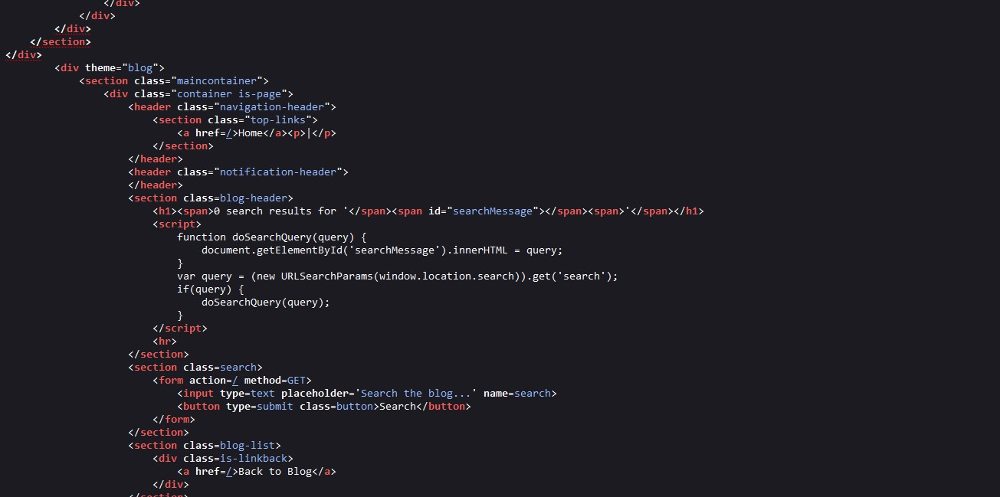
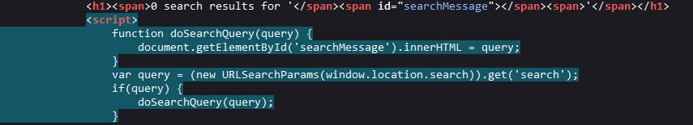

# DOM XSS

This article is a write-up on apprentice-level lab challenge from [Portswigger Academy](https://portswigger.net).

<mark style="color:orange;">**Lab Description:**</mark>

This lab contains a DOM-based cross-site scripting vulnerability in the search blog functionality. It uses an innerHTML assignment, which changes the HTML contents of a div element, using data from location.search.

To solve this lab, perform a cross-site scripting attack that calls the alert function.

<mark style="color:orange;">**Solution:**</mark>

from the description, we can till that the XSS will be in search input, Let\`s try typing anything to see where it will reflect

for example, let\`s type `test` in the search bar

Let\`s see the source code

There is nothing about the injected word in the source code !!

**So why is this? And how this search function works?**

If we looked at the source code again we can notice this script:

it creates a function that grapes the user input value from span tag and pass it to this function and make a search query with it inside the page.

#### <mark style="color:red;">**So what if we just give it a real HTML code to make a query with it !!**</mark>

Let\`s type in search input a simple HTML code with some attribute to run XSS

.jpg>)

Click on search and …

.jpg>)

<mark style="color:red;">**XSS alert is here 😎**</mark>

> #### Thanks for reading
