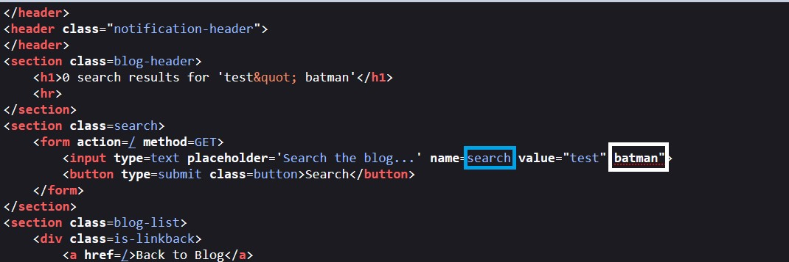

# Reflected XSS

Hello Hackers

In this post I will be sharing my solution for the [Reflected XSS Lab](https://portswigger.net/web-security/cross-site-scripting/contexts/lab-attribute-angle-brackets-html-encoded) from Portswigger Academy


### <mark style="color:orange;">First of all, what is XSS?</mark>

Cross-Site Scripting (XSS) attacks are a type of injection, in which malicious scripts are injected into otherwise benign and trusted websites.&#x20;

XSS attacks occur when an attacker uses a web application to send malicious code, generally in the form of a browser side script, to a different end user.&#x20;

Flaws that allow these attacks to succeed are quite widespread and occur anywhere a web application uses input from a user within the output it generates without validating or encoding it.

#### <mark style="color:orange;">**Lab Description**</mark>

This lab contains a reflected cross-site scripting vulnerability in the search blog functionality where angle brackets are HTML-encoded. To solve this lab, perform a cross-site scripting attack that injects an attribute and calls the alert function.

<mark style="color:orange;">****</mark>

<mark style="color:orange;">**Solution**</mark>

* As always try to type anything and see where it will reflect


* Open source code. Notice that It was reflected in 2 positions


From the lab description, I thought that I must encode angle brackets and create xss payload

<mark style="color:red;">**But wait. What is encoding mean?**</mark>


HTML encoding makes sure that text is displayed correctly in the browser and not interpreted by the browser as HTML.&#x20;

For example, if a text string contains a less than sign (<) or greater than sign (>), the browser would interpret these characters as the opening or closing bracket of an HTML tag.&#x20;

When the character are HTML encoded, they are converted to the string < and > which causes the browser to display the less than sign and greater than sign correctly. Various encodings are used since the computers were born. Even common users have probably met different code page encoding problems that caused website content or an email message to be unreadable, especially if not written in English. Other encodings exist to enable transfer of binary data through text -based protocols that use only a limited set of characters.

**you can find more about HTML encoding** [**here**](https://www.w3schools.com/html/html\_charset.asp)****

****

Back to lab solution. I crafted encoded xss payload like this:

```
&lt;script&gt;alert(2)&lt;/script&gt;
```


**This did not work.** at this point, I realized I was doing something wrong.


* **Next, try to inject payload step by step**
  * Try to inject “ followed by anything. EX. `Test” batman`

.jpg>)

Notice that `" batman`was gone!! from search input but still there in search results

* Open source code



<mark style="color:yellow;">You can notice that</mark> <mark style="color:yellow;"></mark><mark style="color:yellow;">**attributes**</mark> <mark style="color:yellow;"></mark><mark style="color:yellow;">have</mark> **white** <mark style="color:yellow;">color while</mark> <mark style="color:yellow;"></mark><mark style="color:yellow;">**values**</mark> <mark style="color:yellow;"></mark><mark style="color:yellow;">have</mark> <mark style="color:blue;">**blue**</mark> <mark style="color:yellow;">color.</mark>&#x20;

So we can say anything after `“` sign becomes a new attribute&#x20;

**Now, we can craft a new malicious attribute with XSS value**


**And ….. We got XSS alert 😎**


> #### Thanks for reading
